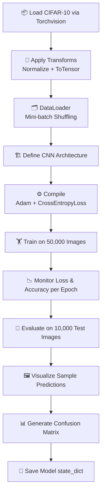

<div align="center">

# 🖼️ CIFAR-10 Image Classification

**A CNN built from scratch with PyTorch classifying 60,000 images across 10 object categories**


<br/>


<br/>

> **End-to-end CNN pipeline — data loading, augmentation, mini-batch training, evaluation, confusion matrix, prediction visualization, and model serialization.**

</div>

---

## 📑 Table of Contents

- [Overview](#-overview)
- [Dataset](#-dataset)
- [Project Structure](#-project-structure)
- [Pipeline](#-pipeline)
- [CNN Architecture](#-cnn-architecture)
- [Training Setup](#-training-setup)
- [Evaluation](#-evaluation)
- [Model Persistence](#-model-persistence)
- [Tech Stack](#-tech-stack)
- [Getting Started](#-getting-started)
- [Learning Outcomes](#-learning-outcomes)
- [Future Improvements](#-future-improvements)
- [Author](#-author)

---

## 📖 Overview

**CIFAR-10 Image Classification** demonstrates a complete computer vision pipeline using a **Convolutional Neural Network built from scratch in PyTorch**. The model learns to classify 32×32 RGB images into one of 10 object categories using feature extraction through convolutional and pooling layers, followed by fully connected classification layers.

The project covers the full workflow — data preprocessing with torchvision transforms, efficient mini-batch training with DataLoader, loss/accuracy monitoring, confusion matrix analysis, prediction visualization, and model serialization using `state_dict()`.

---

## 📊 Dataset

**Dataset:** CIFAR-10 (loaded via `torchvision.datasets.CIFAR10`)

| Split | Images |
|---|---|
| Training | 50,000 |
| Testing | 10,000 |
| **Total** | **60,000** |

**Image Size:** 32 × 32 × 3 (RGB)

### Classes

| Index | Class | Index | Class |
|---|---|---|---|
| 0 | ✈️ Airplane | 5 | 🐶 Dog |
| 1 | 🚗 Automobile | 6 | 🐸 Frog |
| 2 | 🐦 Bird | 7 | 🐴 Horse |
| 3 | 🐱 Cat | 8 | 🚢 Ship |
| 4 | 🦌 Deer | 9 | 🚚 Truck |

---

## 📁 Project Structure

```bash
CIFAR10_Image_Classification/
│
├── data/                               # Auto-downloaded CIFAR-10 dataset
│
├── images/                             # Output visualizations
│   ├── sample_predictions.png
│   └── confusion_matrix.png
│
├── models/
│   └── cifar10_cnn.pth                 # Saved model state dict
│
├── notebooks/
│   └── CIFAR10_Image_Classification.ipynb
│
├── requirements.txt
├── .gitignore
└── README.md
```

---

## 🔄 Pipeline



---

## 🧠 CNN Architecture

```
Input: 3 × 32 × 32 (RGB Image)
          │
          ▼
┌─────────────────────────────┐
│  Conv2D  (32 Filters, 3×3)  │
│  ReLU Activation            │
│  MaxPooling (2×2)           │
└─────────────┬───────────────┘
              │
              ▼
┌─────────────────────────────┐
│  Conv2D  (64 Filters, 3×3)  │
│  ReLU Activation            │
│  MaxPooling (2×2)           │
└─────────────┬───────────────┘
              │
              ▼
┌─────────────────────────────┐
│  Flatten                    │
└─────────────┬───────────────┘
              │
              ▼
┌─────────────────────────────┐
│  Fully Connected (512)      │
│  ReLU Activation            │
└─────────────┬───────────────┘
              │
              ▼
┌─────────────────────────────┐
│  Output Layer (10 Classes)  │
└─────────────────────────────┘
```

| Layer | Config | Output Shape |
|---|---|---|
| Input | 3×32×32 RGB | 3 × 32 × 32 |
| Conv2D + ReLU | 32 filters, 3×3 | 32 × 30 × 30 |
| MaxPooling | 2×2 | 32 × 15 × 15 |
| Conv2D + ReLU | 64 filters, 3×3 | 64 × 13 × 13 |
| MaxPooling | 2×2 | 64 × 6 × 6 |
| Flatten | — | 2304 |
| FC + ReLU | 512 neurons | 512 |
| Output | 10 classes | 10 |

---

## ⚙️ Training Setup

| Parameter | Value |
|---|---|
| Optimizer | Adam |
| Loss Function | CrossEntropyLoss |
| Batch Size | 64 |
| Input Normalization | Mean `(0.5, 0.5, 0.5)` / Std `(0.5, 0.5, 0.5)` |
| Data Shuffling | Enabled (training set) |

### torchvision Transforms Applied

```python
transform = transforms.Compose([
    transforms.ToTensor(),
    transforms.Normalize((0.5, 0.5, 0.5), (0.5, 0.5, 0.5))
])
```

---

## 📏 Evaluation

| Metric | Description |
|---|---|
| **Test Accuracy** | Overall correct predictions on 10,000 unseen test images |
| **Confusion Matrix** | Class-wise prediction breakdown across all 10 categories |
| **Sample Predictions** | Visual comparison of predicted vs actual labels |
| **Classification Report** | Precision, Recall, F1 per class via Scikit-learn |

---

## 💾 Model Persistence

```python
# Save
torch.save(model.state_dict(), "models/cifar10_cnn.pth")

# Load
model = CNNModel()
model.load_state_dict(torch.load("models/cifar10_cnn.pth"))
model.eval()
```

---

## 🛠 Tech Stack

| Category | Library |
|---|---|
| **Deep Learning** | PyTorch |
| **Dataset & Transforms** | Torchvision |
| **Data Manipulation** | NumPy |
| **Visualization** | Matplotlib |
| **Evaluation Metrics** | Scikit-learn |
| **Environment** | Jupyter Notebook |

---

## 🚀 Getting Started

### Prerequisites
- Python 3.8+
- pip

### Installation

```bash
# Clone the repository
git clone https://github.com/Jeevan9898/CIFAR10_Image_Classification.git
cd CIFAR10_Image_Classification

# Install dependencies
pip install -r requirements.txt

# Launch Jupyter
jupyter notebook
```

Open `notebooks/CIFAR10_Image_Classification.ipynb` and run all cells. CIFAR-10 will download automatically on first run.

---

## 🎓 Learning Outcomes

- CNN architecture design from scratch in PyTorch
- Feature extraction via Convolution and Pooling layers
- Understanding feature maps and receptive fields
- Mini-batch training with DataLoader and shuffling
- torchvision transforms for image normalization
- Training loop implementation (forward pass, loss, backward, optimizer step)
- Model evaluation on held-out test data
- Confusion matrix interpretation for multi-class classification
- Model saving and loading via `state_dict()`
- Computer Vision fundamentals

---

## 🔮 Future Improvements

- [ ] Batch Normalization after Conv layers
- [ ] Dropout Regularization to reduce overfitting
- [ ] Data Augmentation (random crop, horizontal flip)
- [ ] Deeper architecture (ResNet-style skip connections)
- [ ] Learning Rate Scheduler
- [ ] TensorBoard training visualization
- [ ] Streamlit app for live image classification
- [ ] Deploy with FastAPI + Docker

---

## 👤 Author

**Jeevan Yadav**

*B.Tech CSE · Deep Learning · Full Stack · Blockchain*

[](https://jeevan-yadav.vercel.app/)
[](https://github.com/Jeevan9898)
[](https://www.linkedin.com/in/jeevan-yadav-b664952b5)

---

<div align="center">

**⭐ If this project helped you understand CNNs and PyTorch, consider giving it a star.**

</div>
